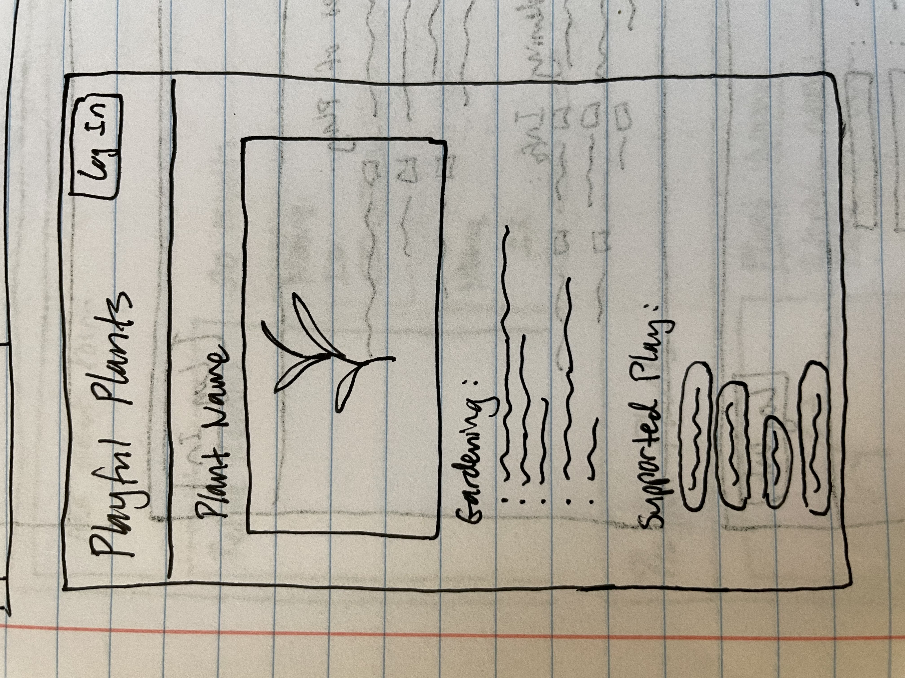
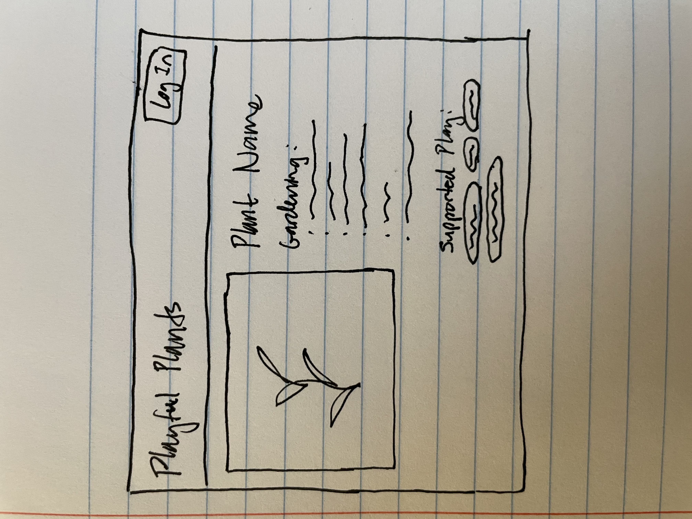

# Project 2: Design Journey

**For each milestone, complete only the sections that are labeled with that milestone.** Refine all sections before the final submission. If you later need to update your plan, **do not delete the original plan, leave it place and append your new plan below the original.** Explain why you are changing your plan. Remember you are graded on your design process. Updating the plan documents your process!

**Replace ALL _TODOs_ with your work.** (There should be no TODOs in the final submission.)

Be clear and concise in your writing. Bullets points are encouraged.

**Everything, including images, must be visible in Markdown Preview.** If it's not visible in Markdown Preview, then we won't grade it. We won't give you partial credit either. **Your design journey should be easy to read for the grader; in Markdown Preview the question _and_ answer should have a blank line between them.**


## Design / Plan (Milestone 1)

**Make the case for your decisions using concepts from class, as well as other design principles, theories, examples, and cases from outside of class (includes the design prerequisite for this course).**

You can use bullet points and lists, or full paragraphs, or a combo, whichever is appropriate. The writing should be solid draft quality.

### Audiences (Milestone 1)

> Who are your site's audiences?
> Briefly explain who the intended audiences are for your project website.
> **DO NOT INVENT RANDOM AUDIENCES HERE!** Use the audiences from the requirements.

_Consumer_: The consumers are parents with developing children who are considering creating nature-rich spaces for their kids through gardening and plants.

_Site Administrator_: The administrators are members of the Playful Plants project, an organization aiming to provide information about how plants can provide opportunities for different kinds of play for young children.


### _Consumer_ Audience Goals (Milestone 1)

> Document your audience's goals.
> List each goal below. There is no specific number of goals required for this, but you need enough to do the job.
> **DO NOT INVENT RANDOM GOALS HERE OR STEREOTYPE HERE!** Your goals are things that your users want accomplish when using the site (e.g. print a list of plants). These are informed by the Playful Plants objectives. Review the assignment's requirements for details.

_Consumer_ Goal 1: Create a garden with plants that will provide year-round interest to the community.

- **Design Ideas and Choices** _How will you meet those goals in your design?_
  - Make information about seasonality of each plant visible in the consumer view of the website, especially on the details page
  - Possibly include filtering between perennial and annual species on the broader catalog view
- **Rationale & Additional Notes** _Justify your decisions; additional notes._
  - Might label perennial/annual on the more details page and have the broader catalog view not show that information (although the user can still use a filter to search for the two types)
  - The broader catalog view is mostly images and might get overloaded with too much text information
  - Could also use a small icon or symbol in the corner or by the plant name to indicate if it is perennial/annual

_Consumer_ Goal 2: Find a variety of plants to add to their garden that will create a high-quality, nature-rich space.

- **Design Ideas and Choices** _How will you meet those goals in your design?_
  - Make gardening information visible in consumer view - this includes data in the "Growing Needs and Characteristics" and "General Classification" sections of the provided table
  - Also allow filtering based off of these categories so consumers can select specific types of plants to maximize variety
  - Consumers can also filter based off of plant growing needs so that they choose plants for their garden that are suited to the environmental conditions and are likely to grow well
  - Possibly have search and sort as well, although these may not be as important as they are to the admin because they may not necessarily have plants in mind already
- **Rationale & Additional Notes** _Justify your decisions; additional notes._
  - Note: may be difficult to filter for Hardiness Zone Range because it is not a boolean type like the other categories (is/is not) but instead provides a range
  - Could use a checklist for including each zone, but would be visually crowded since there are so many hardiness zones
  - May only include that information on the more details page and not include it as a filtering option on the broader catalog view

_Consumer_ Goal 3: Engage children in gardening projects.

- **Design Ideas and Choices** _How will you meet those goals in your design?_
  - On the more details page for each plant, have a section where the different play types it supports are listed
  - These play types will likely not be visible on the broader catalog view or as filter options, but will allow the parents to see the possible play potential of a plant that they are considering adding to their garden
- **Rationale & Additional Notes** _Justify your decisions; additional notes._
  - Having the play types available on the broader catalog view may come across as visually crowded or overwhelming; too many filter options in addition to the gardening info filters
  - Parents may follow a process of looking for plants that are first practical and fit their garden (likely to grow well in the conditions ,are a type that they are looking for e.g. they want to find flowering plants to complete their vision of their garden)
  - After finding plants that are plausible for their garden, they can then look at the play opportunities provided by each plant they are considering and they know are practical
  - Therefore, play types can be a secondary concern for the consumers and broad category filtering should prioritize gardening info instead


### _Consumer_ Persona (Milestone 1)

> Use the goals you identified above to develop a persona of your site's audience.
> Create your persona using GenderMag's customizable personas.
> Take a screenshot and include it here. Persona must be visible in Markdown Preview; do not use PDF format!


### _Administrator_ Audience Goals (Milestone 1)

> Document your audience's goals.
> List each goal below. There is no specific number of goals required for this, but you need enough to do the job.
> **DO NOT INVENT RANDOM GOALS HERE OR STEREOTYPE HERE!** Your goals are things that your users want accomplish when using the site (e.g. print a list of plants). These are informed by the Playful Plants objectives. Review the assignment's requirements for details.


_Administrator_ Goal 1: Be able to update a database of playful plants.

- **Design Ideas and Choices** _How will you meet those goals in your design?_
  - Have forms and buttons in place for adding a new plant to the database, editing a specific entry, and deleting an entry
  - Edit and delete buttons may appear as icons associated with each image in full catalog view
  - When clicked, the edit button leads to a new page (or modal box, depending on practicality later) where all fields for the plant can be changed and saved
  - Delete button preferably brings up a request for confirmation first
- **Rationale & Additional Notes** _Justify your decisions; additional notes._
  - While the administrator does not necessarily need to see gardening information in broad catalog view, it should be visible in detailed page view so they can change it for the consumers if necessary

_Administrator_ Goal 2: Tailor plant selections by various play types.

- **Design Ideas and Choices** _How will you meet those goals in your design?_
  - Have a filter/sort sidebar next to the broad catalog view for the various play types, as well as a search bar
  - Have a filter option where they find plants that fit all selected play types or include at least one
- **Rationale & Additional Notes** _Justify your decisions; additional notes._
  - Likely don't need filters for gardening information, since the admin tends to search by play type primarily and is not aiming to garden with their database

_Administrator_ Goal 3: Print lists of plants to hand out as reference to interested parents.
- **Design Ideas and Choices** _How will you meet those goals in your design?_
  - Have a print preview page where a media query is used to reduce margins/spacing/colors
  - Probably don't need images to save ink
  - Since the lists are just references, they don't necessarily need gardening data for every plant on there as the most important information for the admin is the name, plant id, and play types
- **Rationale & Additional Notes** _Justify your decisions; additional notes._
  - If print is implemented for the consumer as well, might look different because they don't need plant id and may not prioritize play type but instead gardening information
  - (Side note: would be interesting to allow consumer to build lists of plants (they are able to save plants like a bookmarking system, almost like a shopping cart) but this may be time intensive)


### _Administrator_ Persona (Milestone 1)

> Use the goals you identified above to develop a persona of your site's audience.
> Create your persona using GenderMag's customizable personas.
> Take a screenshot and include it here. Persona must be visible in Markdown Preview; do not use PDF format!


### Site Design (Milestone 1)

> Document your _entire_ design process. **We want to see iteration!**
> **Show us the evolution of your design from your first idea (sketch) to the final design you plan to implement (sketch).**
> **Show us how you decided what data to display to each audience.**
> **Plan your URLs for the site.**
> **Provide a brief explanation _underneath_ each design artifact (2-3 sentences).** Explain what the artifact is, how it meets the goals of your personas (**refer to your personas by name**).
>
> **Important!** Plan _all_ site requirements. Don't forget login and logout.

_Initial Designs / Design Iterations:_

Pages to be planned:
- Catalog view for consumers
  - On mobile
  - On desktop
- Details page for consumers
  - On mobile
  - On desktop
- Catalog view for administrators
  - On desktop
- Details page for administrators
  - On desktop
- Log in page for administrators

URLs:
- / for catalog view
- /plant-name for details page (different for each plant)
- /login for login page

Thinking process for deciding what data is shown:
- For administrators like Tim, their goals are focused on editing their data and on seeing play types
  - Thus, Tim doesn't need to be able to filter for gardening information on catalog view
  - But since he may want to edit gardening information for the consumers, this should be visible on the details page
- For consumers like Abi, their goals are focused around finding plants for their garden which their children may like
  - She should be able to filter by gardening info and not by play types
  - She isn't as interested in fulfilling very specific play types - she will likely follow a process of first finding plants that fit the climate and her image of her garden, and then look at these plants in more detail to make final choices
  - However, since she has children who she wants to engage, it may be helpful for her to see play types supported on the details page to see the possible positive side benefits of choosing the plant for her kids
- In conclusion, the catalog views will have a different set of filters for each audience to support their different priorities, but the detail pages will appear the same for both
  - Only exception is that administrators can see options to edit on the details page
  - Revision: administrators' details page will be the edit page; the elements will be form elements right away


  1. Catalog view for consumers on mobile iterations

  

  - Put filters at top since sidebars don't function well on mobile displays
  - One picture per row
  - In second iteration, filter options moved next to each other to make use of space after noticing the filter options are all relatively short text
  - Login corner in upper right as is often done

  

  - Exploring options for filter/sort form at the top
  - Sketching out a dropdown / expansion option (which is done on sites such as JSTOR on mobile)
  - Plan for if an image is not available - slightly grayed out picture used for all such cases

  2. Catalog view for consumers on desktop iterations

  
  

  - Drawing on similar website layouts like rareseeds.com, sidebar with image grid to the right
  - Only colloquial names needed to be visible because consumers like Abi are only interested in the most well-known names; she is less familiar with scientific names and has no need for plant IDs
  - Important for consumers to have images so that Abi can look for plants that fit her vision of her garden

  - Sketch 2 iterates on sketch 1 by moving the images down slightly, allowing space at the top to show how many results were found
  - Also moved sort from the sidebar towards the top right in a dropdown, which is a more familiar design pattern to both Abi and Tim

  3. Details page for consumers on mobile iterations

  
  

  - Page that is displayed when the consumer clicks on a plant image or name in the broader catalog
  - Use familiar layout of name above one large image at top with bullet points for information
  - Abi can quickly find gardening information immediately below the image and if she wants to see play types, they are also visible

  - Sketch 2 changed play types from bullet points into round tags to offset them from the gardening information and limit scrolling and shift focus to the gardening content

  4. Details page for consumers on desktop iterations

  
  

  - Page that is displayed when the consumer clicks on a plant image or name in the broader catalog
  - Avoids use of a hero image by aligning image next to text

  - Sketch 2 moved plant name to the right side to better support scanning styles - when the text content is all placed towards the right half, Abi will have an easier time getting a quick overview

  5. Catalog view for administrators on desktop iterations

  
  

  - Add form at top for quick access; sidebar for filtering and sorting so that Tim can see changes applied immediately
  - Images not needed because the admin are more concerned with the play types than the other information, so each entry is a horizontal "card" that can be clicked on for a more details page identical to the consumers'

  - Sketch 2 showed number of results and moved sorting to an upper dropdown menu to better match known design patterns and have it match the consumer catalog slightly more
  - Put edit and delete icon buttons on the upper right of each entry as a shortcut for updating the plant

  6. Details page for administrators on desktop iterations

  
  

  - The details page for the admin has slightly more information than for the consumer because the details page also serves as the admin's edit form for each entry, so all information needs to be present if the admin wants to update
  - Each element is an editable form element, so that Tim can efficiently update entries without having to click extra buttons
  - Experimenting with moving around parts of the form to accommodate desktop's large size

_Final Design:_

1. Catalog view for consumers on mobile


- Largely similar to sketch 2, but two photos on each row instead of one so that the user is not overwhelmed with large photos
- Follows the layout of similar sites such as rareseeds.com
- Uses collapses filter section to save space vertically

2. Catalog view for consumers on desktop


- Increased spacing between images vertically to be less visually crowded in Abi's point of view
- Added dropdown menu in filter because the type of plant is better suited to that than a list of checkboxes, given the type can only be one of a list

3. Details page for consumers on mobile



- Made list of tags of supported play types from inline into block because on mobile, there may not be enough space for wrapping to work properly

 4. Details page for consumers on desktop



- Expanded text content to better fit what what likely happen - there may be empty space underneath the image, but Abi has likely seen this in similar websites before, especially those that are associated with shopping
- Prevents Abi's eyes from having to jump to different spots on the page

5. Catalog view for administrators on desktop


- Fixed margin inconsistencies in sketch 2 by aligning everything in an entry to the left

6. Details page for administrators on desktop


- Decided to move form elements from being underneath the image to the side in a stacked layout with checkboxes being inline as needed, so that the form has good alignment and is filled out in a smooth vertical motion
- This way Tim does not have to jump around the page to fill out all fields and the layout is more similar to the details page seen by the consumers

### Design Pattern Explanation/Reflection (Milestone 1)

> Write a one paragraph (6-8 sentences) reflection explaining how you used design patterns for media catalogs in your site's final design.

The login button is placed in the upper right corner, where it is typically located on many websites. On desktop, a sidebar with filters is a common design pattern, especially one that is located on the left side and is aligned with the media so that changes can be applied adjacently. Sorting is also usually done in dropdown menus on the upper right and is separate from the filtering sidebar. For the consumer, a grid of images was used with limited text associated with each, a common simple layout for media catalogs. By being able to see a separate page with more details by clicking on each square, this design emulates many similar websites with a catalog. Finally, aligning text on the details page towards the right half and the image on the left is following a common pattern seen in many shopping sites.


### Cognitive Styles Explanation/Reflection (Milestone 1)

> Write a one paragraph (6-8 sentences) reflection explaining how your final design supports the cognitive styles of each persona.

_Consumer Cognitive Styles Reflection:_

By using very common design patterns and a simple layout with high amounts of alignment, Abi sees aspects of the website as familiar and predictable, which suits her lower computer self-efficacy and attitude toward risk. By placing the filters in a visually prominent location, Abi can also quickly search for the plants that will suit her garden without having to scroll or click around too much, suiting her motivations. She wants to accomplish her tasks using comfortable methods instead of experimentation, so familiar steps like clicking on recognizable elements helps her learn by process. By making the images and plant names clickable links on catalog view, she feels comfortable taking the next step after finding a plant she wants to know more about. With catalog view, since everything is visible in a quick overview, Abi can look over what the site offers as a whole instead of immediately choosing a specific plant's information, suiting her information processing style.


_Site Administrator Cognitive Styles Reflection:_

On catalog view, subheadings for different sections like Add Plant, Refine Results, and Results allow Tim to find leads to figure out how to accomplish tasks. This suits his selective information processing style. The edit and delete buttons being available immediately next to each entry serve as shortcuts and suit Tim's high computer self-efficacy and risk tolerance. He is more likely to find these tools useful than be hesitant to click on them. Since he likes tinkering and is motivated by exploration, these details like small buttons are something that Tim is likely to notice and make use of. Instead of following a process like clicking on one entry and then clicking an edit button, then clicking into a field to change it, his high risk tolerance allows him to utilize shortcut tools without much concern.


## Implementation Plan (Milestone 1, Milestone 2, Milestone 3, Final Submission)

### Database Schema (Milestone 1)
> Describe the structure of your database. You may use words or a picture. A bulleted list is probably the simplest way to do this. Make sure you include constraints for each field.
> **Hint: You probably need a table for "entries", `tags`, `"entry"_tags`** (stores relationship between entries and tags), and a `users` tables.
> **Hint: For foreign keys, use the singular name of the table + _id.** For example: `image_id` and `tag_id` for the `image_tags` (tags for each image) table.

Table: entries

- id: INTEGER {PK, U, NN, AI}
- name: STRING {NN}
- scientific_name: STRING {NN}
- plant_id: STRING {U, NN}

- exploratory_constructive_play: INTEGER {NN}
- exploratory_sensitive_play : INTEGER {NN}
- physical_play: INTEGER {NN}
- imaginative_play: INTEGER {NN}
- restorative_play: INTEGER {NN}
- expressive_play: INTEGER {NN}
- play_with_rules: INTEGER {NN}
- bio_play: INTEGER {NN}
- Revision: above play types will be removed as fields in this table and will become tags instead

Table: tags

- id: INTEGER {PK, U, NN, AI}
- name: TEXT {NN}

Table: entry_tags

- id: INTEGER {PK, U, NN, AI}
- entry_id: {NN} FOREIGN KEY REFERENCES entries
- tag_id: {NN} FOREIGN KEY REFERENCES tags

Table: users

- id: INTEGER {PK, U, NN, AI}
- username: TEXT {U, NN}
- password: TEXT {NN}

LATER REVISION - play types will instead be included under tags, which removes all of the play type fields from table "entries". Examples of possible records under "name" in table "tags" would be "bio play", "restorative play", "shrub", "partial shade" and other information that is not the main plant data (plant name, scientific name, plant id).


### Database Query Plan (Milestone 1, Milestone 2, Milestone 3, Final Submission)
> Plan _all_ of your database queries. You may use natural language, pseudocode, or SQL.

- For admin:

```
// all records
SELECT * FROM entries;
```

```
// filtering
SELECT * FROM entries WHERE (the play type(s) checked by the admin is 1, indicating the plant supports it);

// sorting
SELECT * FROM entries ORDER BY id DESC; // for most recent to oldest
SELECT * FROM entires ORDER BY name ASC; // for alphabetical A-Z);
```

```
// editing a plant entry
UPDATE entries SET
  field1 = value1,
  field2 = value2,
  ...
  WHERE (id=___);

  DELETE FROM entries WHERE (id=___);

  INSERT INTO entries (fields) VALUES (parameter markers using an array);
```


- For consumer:
```
// filtering
SELECT * FROM entries WHERE (the gardening conditions checked by the consumer is 1, indicating it is true for the plant);

// sorting
SELECT * FROM entries ORDER BY id DESC; // for most recent to oldest
SELECT * FROM entires ORDER BY name ASC; // for alphabetical A-Z);
```


### Code Planning (Milestone 1, Milestone 2, Milestone 3, Final Submission)
> Plan any PHP code you'll need here using pseudocode.
> Tip: Break this up by pages. It makes it easier to plan.

```
// for outputting into html for admin catalog view after retrieving records:
for each record in records:
  echo the name into the heading of a data "entry" div
  echo the scientific name into the heading
  echo the plant id into the paragraph element below the heading
  check each field related to play types and see what it is
    if it is a 1:
      echo out the name of the field into a list element
    else:
      do nothing
```

```
// for outputting into html for consumer catalog view after retrieving records:
for each record in records:
  echo image associated with the id for the record into the square div
  echo the name into the div underneath the picture
```

```
// big picture add form validation:
check if form is valid
if form valid:
  show confirmation message
else:
  form is not valid
  set all variables of form input to sticky values
  remove hidden from the feedback messages for the affected field(s)
```

```
// editing an entry
if the admin clicks the edit button or clicks on a plant name from catalog view:
  use hidden inputs to echo current data for that entry id into the edit form that comes up
  if the admin clicks save:
    update the database via database query where the id from the hidden input is used so the right entry is edited
```


```
TODO: WRITE MORE PSEUDOCODE HERE, between the back-tick lines.
```

TODO: ...


### Accessibility Audit (Final Submission)
> Tell us what issues you discovered during your accessibility audit.
> What do you do to improve the accessibility of your site?

TODO


## Reflection (Final Submission)

### Audience (Final Submission)
> Tell us how your final site meets the goals of your audiences. Be specific here. Tell us how you tailored your design, content, etc. to make your website usable for your personas.

TODO


### Additional Design Justifications (Final Submission)
> If you feel like you haven’t fully explained your design choices in the final submission, or you want to explain some functions in your site (e.g., if you feel like you make a special design choice which might not meet the final requirement), you can use the additional design justifications to justify your design choices. Remember, this is place for you to justify your design choices which you haven’t covered in the design journey. You don’t need to fill out this section if you think all design choices have been well explained in the design journey.

TODO


### Self-Reflection (Final Submission)
> Reflect on what you learned during this assignment. How have you improved from Project 2? What would you do differently next time?

TODO


> Take some time here to reflect on how much you've learned since you started this class. It's often easy to ignore our own progress. Take a moment and think about your accomplishments in this class. Hopefully you'll recognize that you've accomplished a lot and that you should be very proud of those accomplishments!

TODO


### Grading: Step-by-Step Instructions (Final Submission)
> Write step-by-step instructions for the graders.
> The project if very hard to grade if we don't understand how your site works.
> For example, you must login before you can delete.
> For each set of instructions, assume the grader is starting from /

_View all entries:_

1. TODO
2.

_View all entries for a tag:_

1. TODO
2.

_View a single entry's details:_

1. TODO
2.

_How to insert and upload a new entry:_

1. TODO
2.

_How to delete an entry:_

1. TODO
2.

_How to edit and existing entry and its tags:_

1. TODO
2.
